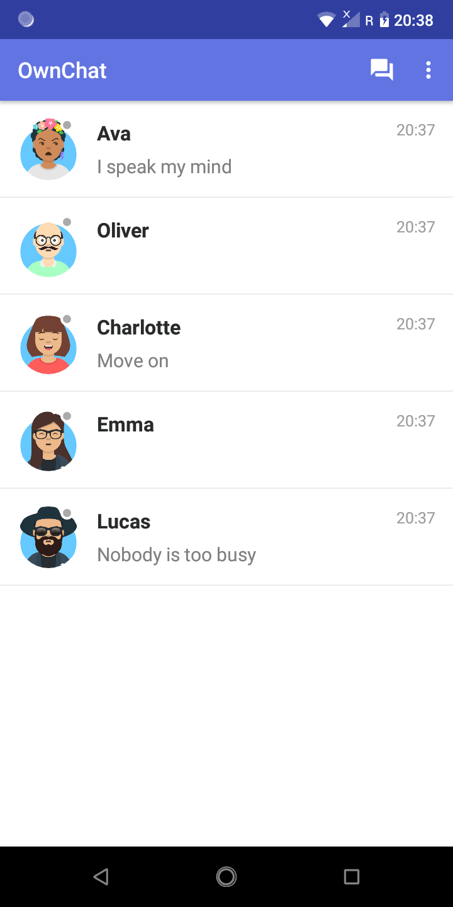
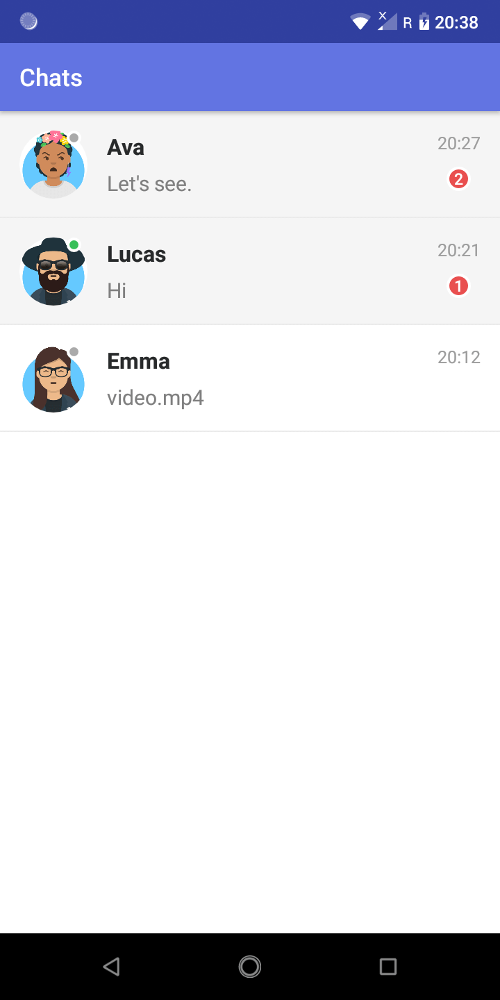
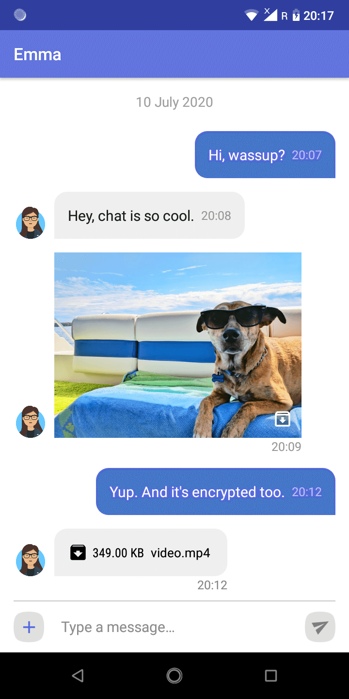

# OwnChat
Chat with your friends and family using own chat app. Based on Firebase Cloud Firestore and built using awesome ChatKit UI for Android. (https://github.com/stfalcon-studio/ChatKit)

  

## Setup
Step 1: Create a Firebase project by following the instructions given [here](https://firebase.google.com/docs/android/setup). Register app with package name 'com.example.ownchat'. Download google-services.json and put it in [app](https://github.com/appsroxcom/OwnChat/tree/master/app) direcory.

Step 2: In Firebase Console - 
  * Go to Authentication > Sign-in method. Enable Anonymous in sign-in providers.
  * Go to Database > Cloud Firestore. Create database and start in test mode.
  * Go to Storage > Get started. Set up Cloud Storage.

Step 3: Build and run your app. That's it! 
You will need two or more devices to see other users and chat. No signup is required. Settings screen allows you to change name, avatar, etc.

> Keep an eye on Logcat in Android Studio as you may get a special link for indexing of tables.

Step 4: For security - 
  * Go to Database > Rules. Edit the rules as given below and Publish.
```
rules_version = '2';
service cloud.firestore {
  match /databases/{database}/documents {

    match /users/{userId} {
      allow read: if request.auth != null;
      allow write: if request.auth != null && request.auth.uid == userId;
    }
    
    match /chats/{chatId} {
      allow create: if request.auth != null;
      allow read, update, delete: if request.auth != null && request.auth.uid in resource.data.userIds;
      
      match /{document=**} {
        allow read, write: if request.auth != null;
      }
    }
  }
}
```
Step 5 (Optional): For notifications to work follow the instructions given [here](https://firebase.google.com/docs/functions/get-started) to set up Cloud Functions. Replace index.js with the one in [functions](https://github.com/appsroxcom/OwnChat/tree/master/functions) directory. Deploy functions and it should be visible in Firebase Console under Functions.

## Configuration

  * Encryption: Enable encryption of messages by initializing ChatKit in [App](https://github.com/appsroxcom/OwnChat/blob/master/app/src/main/java/com/example/ownchat/App.java) class as follows -
```
ChatKit.init(this, true, true);
```

  * Caching: User and Chat list are cached by default. You may change the ```REFRESH_INTERVAL``` in [CommonUtil](https://github.com/appsroxcom/OwnChat/blob/master/app/src/main/java/com/example/ownchat/CommonUtil.java) class.
  
  * Limits: Query limits can be changed in ```CommonUtil``` class as well. File size limit for attachments can be specified in [config.xml](https://github.com/appsroxcom/OwnChat/blob/master/app/src/main/res/values/config.xml).
  
  For further customizations, you may fork the [LiveChatKit](https://github.com/appsroxcom/LiveChatKit) library and include ```chatkit``` module in your project.

## References

  1. https://github.com/appsroxcom/LiveChatKit
  2. https://github.com/appsroxcom/GetAvataaars

  
